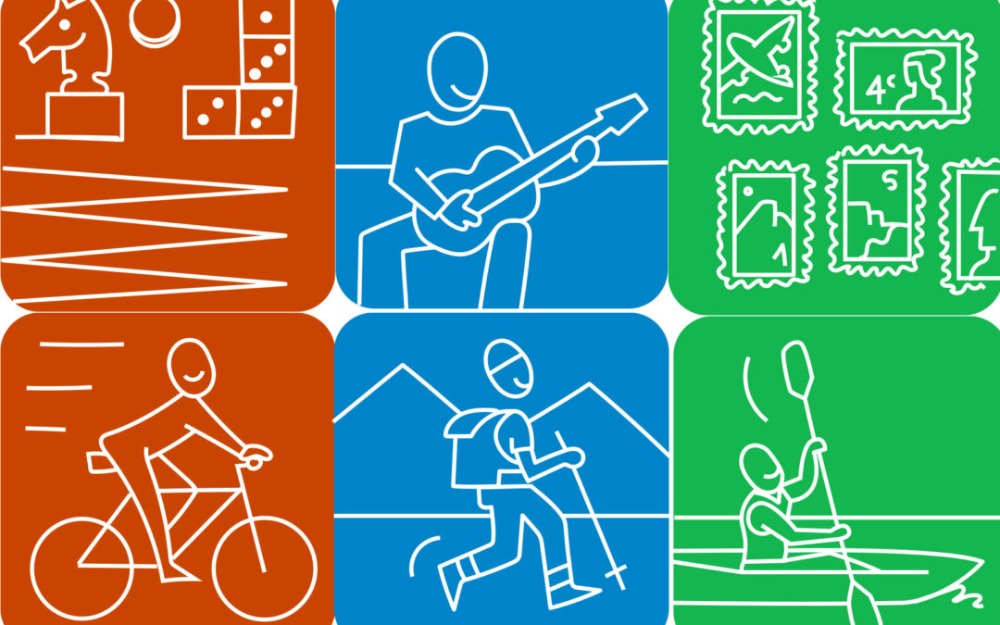
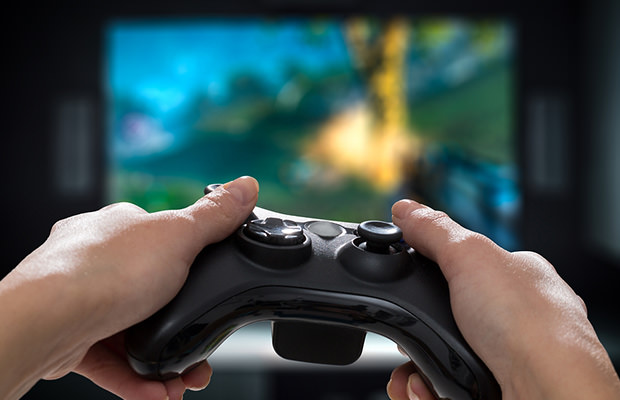

[Enjoyining my freetime.](#). Having a hobby that we enjoy brings us joy and enriches our lives. It gives us something fun to do
during our leisure time and affords us the opportunity to learn new skills. We are very fortunate to have
so many different options out there today. In fact, there are entire websites devoted to hobbies and interests.
The best way to cultivate a new hobby is to try something new. The world is full of wonderful, exciting activities that we can explore and adopt as our own. Of course, all of us are unique and, therefore,
our interests and hobbies vary. But once we find a hobby that we truly enjoy and are passionate about,
we become hooked. It becomes part of our lives and captivates us in a very personal way.

There are many reasons why all of us should have at least one hobby, but here are the main
advantages:
- It makes you more interesting. People who have hobbies have experiences and stories that they
can share with others. They also have specialized knowledge that they can teach to anyone who also
has an interest in the same topics as they do.
- It helps to relieve stress by keeping you engaged in something you enjoy. Hobbies give you a
way to take your mind off the stresses of everyday life. They let you relax and seek pleasure in activities that aren’t associated with work, chores or other responsibilities.
- Hobbies help you become more patient. In order to develop a new hobby, you have to learn how
to do something that is brand new to you. The odds are there will be a learning curve, and you will
need to be patient in order to build your skills.
- Having a hobby can help your social life and create a bond with others. A hobby is something
that you can frequently enjoy with other people. Whether you join a club, play in a league, or just gift
others with the fruits of your labor, a hobby is a great way to meet and get closer to people who have
the same interests as you do.
- It increases your confidence and self-esteem. The odds are that if you really enjoy an activity, you
are usually pretty good at it. Any activity that you can excel in is an opportunity for you to build your
confidence and develop pride in your accomplishments.

# Top Hobbies

1. Read books

2. Listen to music

3. Play videogames

4. Watch anime, movies, series and doramas.
