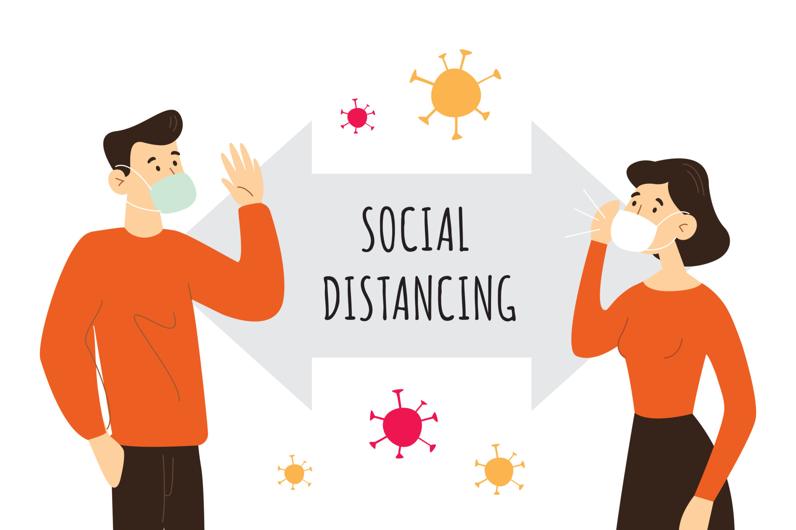

[Living in a new world defeated by a virus.](#). One thing that is certain, we know that adjusting to change can be challenging. Be it planned or unplanned, gradual or sudden, change is inevitable and very much part of being human. Over the past few months, we’ve experienced an unprecedented shift in our way of life due to COVID-19. Pre-pandemic, who would’ve thought that toilet paper could become as precious as gold! And now, a trip to do a weekly grocery shop seems like an adventure of its own! Before we know it, we’ve (reluctantly) let go of our old normal and now settling into what seems to be our new normal. 

Even when society starts up again, there will still be restrictions and we are facing fundamental shifts to our way of life. So, what does a New Normal look like? Here are some thoughts (and realities) below; with tips on how to adjust to the New Normal to follow.

 

THE WAY WE LIVE IS DIFFERENT

- Masks and gloves may be commonplace, depending on where in the world you live.

- Queuing is now the norm, be it when visiting health professionals, going to the shops, or even getting in a lift.

- Public transport looks very different, with social distancing in place and commuters wearing  masks and gloves.

- We do a double-take when we hear someone cough, sneeze, or sniffle. We’ve been conditioned these past few months to be hypervigilant for these symptoms, but hopefully this might also mean that higher standards of hand and personal hygiene will continue.

- We’ll start to holiday more in our own backyards due to travel restrictions, which can only be a good thing for local economies as they cope with the decline in overseas and interstate tourist numbers. Wanderlust for overseas exotic locations will also be on the rise, and Instagram will no doubt fuel those desires.

- The small things that make up our community have changed. No more sausage sizzles at Bunnings, no community sports, no lingering over brunch with friends at the local cafe, and  salons have closed due to the pandemic. We’re hoping our local small businesses - our hairdressers, barbers, cafes, restaurants, health professionals, newsagents, boutiques - make it through the other end (so be sure to support your local small business!)

- The larger sporting landscape has also changed. Sporting leagues have paused but are cautiously eyeing a return, and national and international meets are near impossible given travel restrictions. Sport has also been hit particularly hard by coronavirus in the year of the Summer Olympic Games, which have now been postponed to 2021.

