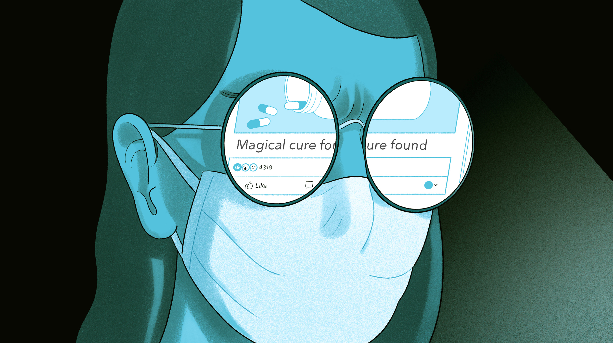
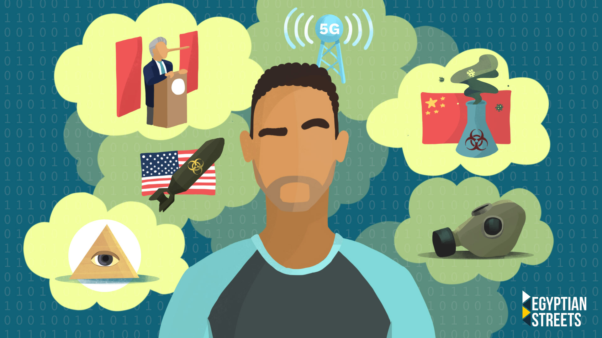

[How to survive the COVID-19](#). Currently, we all are under self isolation and quarantining in our homes with our families. But there are also a large section of the society who live alone away from their families. And as easy as it may seem, staying in quarantine if you are alone, without any human touch is not at all a cake walk. Here’s a guide to survive your quarantine, if you are all by yourself.

1. Be in constant touch with atleast one member of your family over phone: This is the time when you would be missing your family the most. Therefore it is important for you to give your daily update to some in the family with whom you bond the most. Their presence even if it is virtually will give immense strength and a feeling that you are not alone in this.

2. Set up a routine: You need to follow the same routine which you had when you were going out to work. Except for the fact that you are not stepping out. If you have been assigned work-from-home, you can sit comfortably and do that or you can pick up a reading habit.This will maintain a balance and wouldn’t let you feel that something is out of place.

3. Take a little break from technology and meditate: We are constantly glued to our mobile phones and it has increased even more during self-isolation because people have nothing else to do. You can deviate your mind from technology and try meditation. You can also do some breathing exercises to begin with.

4. Plan your meal: You can’t be skipping your breakfast, lunch or dinner just because you are home the whole day and you have no one to cook for you. Have oats, banana shake or cornflakes in the morning. You can also supplement it with fruits rich in vitamin c like oranges. Look up for easy veggie meals that can be cooked easily for lunch online. Also try having your dinner by 7 pm since you are home.

5. Talk to yourself: Self-talk is normal and is also good for mental health. And try doing it more when you are stressed or anxious. Because talking to self helps in slowing down our thoughts and process them differently.

Now keep social distance is the key to be secure...

Conspiracy theories need just the right ingredients to take off within a population, and the COVID-19 pandemic has been a breeding ground for them. A Pew Research Center survey recently asked people if they had heard the theory that the COVID-19 outbreak was intentionally planned by people in power. Seventy-one percent of U.S. adults said they had. And a third of those respondents said it was "definitely" or "probably" true.

One version of this theory goes something like this: The COVID-19 pandemic is part of a strategy conceived by global elites — such as Bill Gates — to roll out vaccinations with tracking chips that would later be activated by 5G, the technology used by cellular networks.
