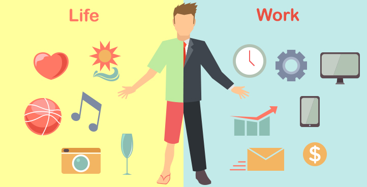

[Trying to avoid the burnout.](#). Often, work takes precedence over everything else in our lives. Our desire to succeed professionally can push us to set aside our own well-being. Creating a harmonious work-life balance or work-life integration is critical, though, to improve not only our physical, emotional and mental well-being, but it's also important for our career.

In short, work-life balance is the state of equilibrium where a person equally prioritizes the demands of one's career and the demands of one's personal life. Some of the common reasons that lead to a poor work-life balance include:

- Increased responsibilities at work
- Working longer hours
- Increased responsibilities at home
- Having children

Here are eight ways to create a better work-life balance:
1. Accept that there is no 'perfect' work-life balance.
When you hear "work-life balance," you probably imagine having an extremely productive day at work, and leaving early to spend the other half of the day with friends and family. While this may seem ideal, it is not always possible. 

2. Find a job that you love.
Although work is an expected societal norm, your career shouldn't be restraining. If you hate what you do, you aren't going to be happy, plain and simple. You don't need to love every aspect of your job, but it needs to be exciting enough that you don't dread getting out of bed every morning. 

3. Prioritize your health.
Your overall physical, emotional and mental health should be your main concern. If you struggle with anxiety or depression and think therapy would benefit you, fit those sessions into your schedule, even if you have to leave work early or ditch your evening spin class. If you are battling a chronic illness, don't be afraid to call in sick on rough days. Overworking yourself prevents you from getting better, possibly causing you to take more days off in the future. 

4. Don't be afraid to unplug.
Cutting ties with the outside world from time to time allows us to recover from weekly stress, and gives us space for other thoughts and ideas to emerge. Unplugging can mean something simple like practicing https://www.businessnewsdaily.com, instead of checking work emails. 

5. Take a vacation.
Sometimes, truly unplugging means taking vacation time and shutting work completely off for a while. Whether your vacation consists of a one-day staycation or a two-week trip to Bali, it's important to take time off to physically and mentally recharge. 

6. Make time for yourself and your loved ones.
While your job is important, it shouldn't be your entire life. You were an individual before taking this position, and you should prioritize the activities or hobbies that make you happy. Chancey said that achieving work-life balance requires deliberate action. 

7. Set boundaries and work hours.
Set boundaries for yourself and your colleagues, to avoid burnout. When you leave the office, avoid thinking about upcoming projects or answering company emails. Consider having a separate computer or phone for work, so you can shut it off when you clock out. If that isn't possible, use separate browsers, emails or filters for your work and personal platforms.

8. Set goals and priorities (and stick to them).
Pay attention to when you are most productive at work and block that time off for your most important work-related activities. Avoid checking your emails and phone every few minutes, as those are major time-wasting tasks that derail your attention and productivity. Structuring your day can increase productivity at work, which can result in more free time to relax outside of work.

