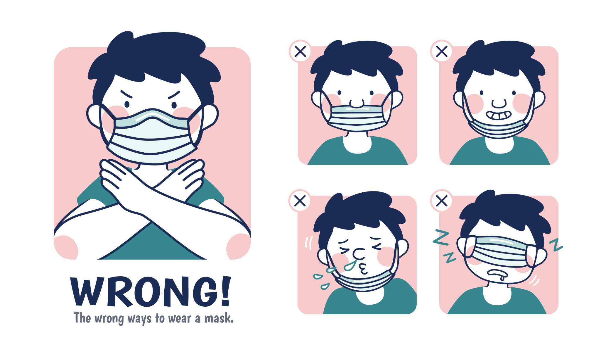
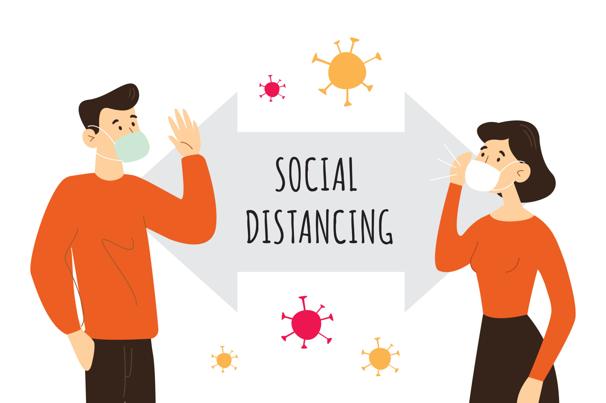

[Viviendo en un mundo derrotado por un virus.](#). Una cosa es cierta, sabemos que ajustarse al cambio puede ser un desafío. Ya sea planeado o no, gradual o repentino, el cambio es inevitable y forma parte del ser humano. En los últimos meses, hemos experimentado un cambio sin precedentes en nuestra forma de vida debido a COVID-19. Pre-pandémico, ¿quién hubiera pensado que el papel higiénico podría llegar a ser tan valioso como el oro? Y ahora, un viaje para hacer una compra semanal parece una aventura por sí misma! Antes de que nos demos cuenta, hemos (a regañadientes) abandonado nuestra vieja normalidad y ahora nos estamos instalando en lo que parece ser nuestra nueva normalidad. 

Incluso cuando la sociedad comience de nuevo, seguirá habiendo restricciones y nos enfrentamos a cambios fundamentales en nuestra forma de vida. Entonces, ¿cómo es una Nueva Normalidad? Aquí hay algunos pensamientos (y realidades) a continuación; con consejos sobre cómo ajustarse a la Nueva Normalidad a seguir.

 

LA FORMA EN QUE VIVIMOS ES DIFERENTE

- Las máscaras y los guantes pueden ser comunes, dependiendo del lugar del mundo en el que vivas.

- Hacer cola es ahora la norma, ya sea para visitar a los profesionales de la salud, ir de compras, o incluso subir a un ascensor.

- El transporte público se ve muy diferente, con el distanciamiento social en el lugar y los viajeros que usan máscaras y guantes.

- Hacemos una doble toma cuando oímos a alguien toser, estornudar o resoplar. Hemos sido condicionados estos últimos meses a ser hipervigilantes para estos síntomas, pero esperamos que esto también pueda significar que los estándares más altos de higiene de manos y personal continúen.

- Empezaremos a pasar más tiempo de vacaciones en nuestros propios patios debido a las restricciones de viaje, lo que sólo puede ser bueno para las economías locales, ya que se enfrentan a la disminución del número de turistas extranjeros e interestatales. El deseo de viajar a lugares exóticos en el extranjero también aumentará, e Instagram sin duda alimentará esos deseos.

- Las pequeñas cosas que componen nuestra comunidad han cambiado. No más chispas de salchicha en Bunnings, no más deportes comunitarios, no más almuerzos con amigos en el café local, y los salones han cerrado debido a la pandemia. Esperamos que nuestros pequeños negocios locales - nuestros peluqueros, barberos, cafés, restaurantes, profesionales de la salud, quioscos, boutiques - lleguen al otro extremo (¡así que asegúrense de apoyar a su pequeño negocio local!)

- El panorama deportivo más amplio también ha cambiado. Las ligas deportivas han hecho una pausa pero están mirando con cautela el regreso, y los encuentros nacionales e internacionales son casi imposibles dadas las restricciones de viaje. El deporte también se ha visto particularmente afectado por el coronavirus en el año de los Juegos Olímpicos de Verano, que ahora se han pospuesto hasta el 2021.

