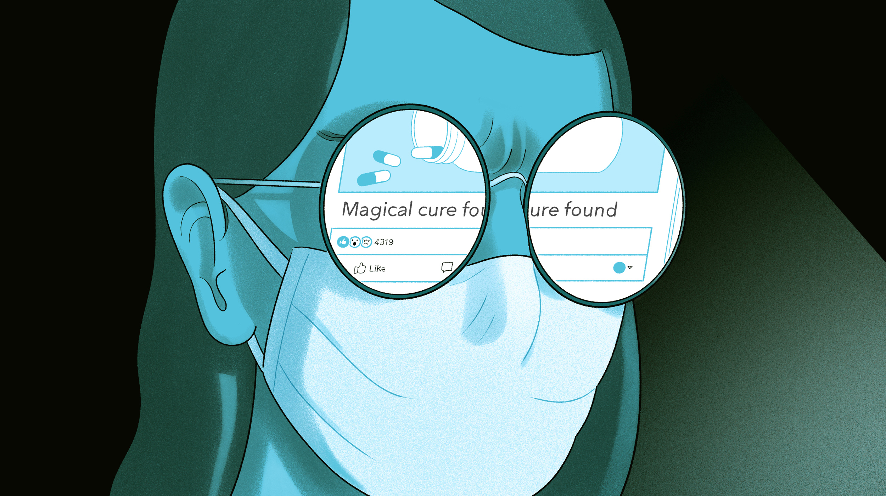
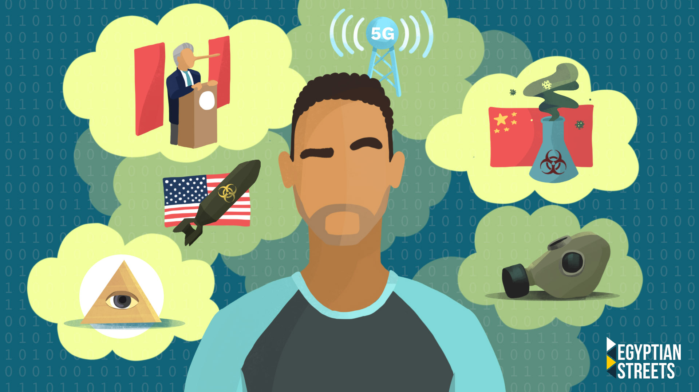

[Sera posible un apocalipsis zombie ?.](#). Actualmente, todos estamos bajo aislamiento y cuarentena en nuestros hogares con nuestras familias. Pero también hay una gran parte de la sociedad que vive sola, lejos de sus familias. Y por fácil que parezca, permanecer en cuarentena si se está solo, sin ningún contacto humano no es nada fácil. Aquí hay una guía para sobrevivir a la cuarentena, si estás solo.

1. 1. Manténgase en contacto constante con al menos un miembro de su familia por teléfono: Este es el momento en el que extrañarías más a tu familia. Por lo tanto, es importante que te pongas al día con algunos de los miembros de la familia con los que más te unes. Su presencia, aunque sea virtual, le dará una inmensa fuerza y la sensación de que no está solo en esto.

2. Establezca una rutina: Debes seguir la misma rutina que tenías cuando salías a trabajar. Excepto por el hecho de que no vas a salir. Si se le ha asignado un trabajo desde casa, puede sentarse cómodamente y hacerlo o puede adquirir un hábito de lectura. Esto mantendrá el equilibrio y no le hará sentir que algo está fuera de lugar.

3. 3. Tómese un pequeño descanso de la tecnología y medite: Estamos constantemente pegados a nuestros teléfonos móviles y ha aumentado aún más durante el auto-aislamiento porque la gente no tiene nada más que hacer. Puedes desviar tu mente de la tecnología y probar la meditación. También puedes hacer algunos ejercicios de respiración para empezar.

4. Planea tu comida: No puedes saltarte el desayuno, el almuerzo o la cena sólo porque estés en casa todo el día y no tengas a nadie que te cocine. Come avena, batido de plátano o copos de maíz por la mañana. También puedes complementarlo con frutas ricas en vitamina C como las naranjas. Busca comidas vegetarianas fáciles de preparar para el almuerzo en línea. También intenta cenar antes de las 7 de la tarde ya que estás en casa.

5. 5. Habla contigo mismo: Hablar contigo mismo es normal y también es bueno para la salud mental. Y trata de hacerlo más cuando estés estresado o ansioso. Porque hablar contigo mismo ayuda a ralentizar nuestros pensamientos y a procesarlos de forma diferente.

Actualmente mantener el distanciamiento social es la clave para mantenerse seguro.

Las teorías conspirativas necesitan los ingredientes adecuados para despegar dentro de una población, y la pandemia COVID-19 ha sido un caldo de cultivo para ellas. Una encuesta del Centro de Investigación Pew preguntó recientemente a la gente si habían escuchado la teoría de que el brote de COVID-19 fue planeado intencionalmente por personas en el poder. El 71% de los adultos de EE.UU. dijeron que lo habían hecho. Y un tercio de esos encuestados dijo que era "definitivamente" o "probablemente" cierto.

Una versión de esta teoría dice algo así: La pandemia COVID-19 es parte de una estrategia concebida por las elites globales - como Bill Gates - para desplegar vacunas con chips de rastreo que más tarde serían activados por 5G, la tecnología utilizada por las redes celulares.

