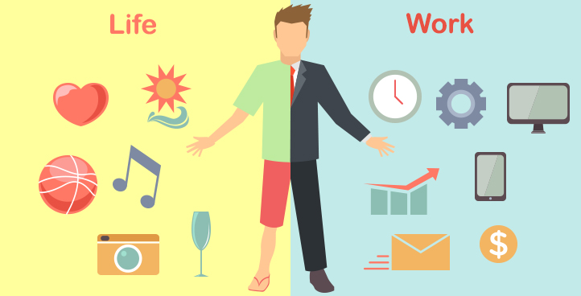

[Evitando el desgaste laboral.](#). Nuestro deseo de tener éxito profesionalmente puede empujarnos a dejar de lado nuestro propio bienestar. Sin embargo, crear un equilibrio armonioso entre trabajo y vida o la integración de trabajo y vida es fundamental para mejorar no sólo nuestro bienestar físico, emocional y mental, sino que también es importante para nuestra carrera.

En resumen, el equilibrio entre trabajo y vida es el estado de equilibrio en el que una persona prioriza por igual las exigencias de su carrera y las de su vida personal. Algunas de las razones comunes que llevan a un mal equilibrio entre trabajo y vida personal incluyen:

- Aumento de las responsabilidades en el trabajo
- Trabajando más horas
- Aumento de las responsabilidades en el hogar
- Tener hijos

Aquí hay ocho maneras de crear un mejor equilibrio entre trabajo y vida:
1. Aceptar que no hay un equilibrio "perfecto" entre trabajo y vida.
Cuando escuchas "equilibrio entre trabajo y vida", probablemente imaginas tener un día extremadamente productivo en el trabajo, y salir temprano para pasar la otra mitad del día con los amigos y la familia. Aunque esto puede parecer ideal, no siempre es posible. 

2. Encuentra un trabajo que te guste.
Aunque el trabajo es una norma social esperada, su carrera no debe ser restrictiva. Si odias lo que haces, no vas a ser feliz, simple y llanamente. No es necesario que ames cada aspecto de tu trabajo, pero tiene que ser lo suficientemente excitante como para que no tengas miedo de salir de la cama cada mañana. 

3. Prioriza tu salud.
Tu salud física, emocional y mental en general debe ser tu principal preocupación. Si lucha contra la ansiedad o la depresión y piensa que la terapia le beneficiaría, incluya esas sesiones en su horario, incluso si tiene que salir del trabajo temprano o abandonar su clase nocturna de spinning. Si está luchando contra una enfermedad crónica, no tenga miedo de llamar a la enfermería en los días difíciles. El exceso de trabajo impide que se mejore, lo que puede hacer que tenga que tomarse más días libres en el futuro. 

4. No tenga miedo de desenchufarse.
Cortar los lazos con el mundo exterior de vez en cuando nos permite recuperarnos del estrés semanal, y nos da espacio para que surjan otros pensamientos e ideas. Desenchufarse puede significar algo tan simple como practicar https://www.businessnewsdaily.com, en lugar de revisar los correos electrónicos del trabajo. 

5. Tómese unas vacaciones.
A veces, desenchufarse de verdad significa tomarse vacaciones y dejar el trabajo completamente fuera por un tiempo. Ya sea que sus vacaciones consistan en una estadía de un día o un viaje de dos semanas a Bali, es importante tomar tiempo libre para recargarse física y mentalmente. 

6. Dedique tiempo para usted y sus seres queridos.
Aunque tu trabajo es importante, no debería ser toda tu vida. Usted era un individuo antes de tomar esta posición, y debe priorizar las actividades o pasatiempos que lo hacen feliz. Chancey dijo que lograr el equilibrio entre el trabajo y la vida privada requiere una acción deliberada. 

7. Establecer límites y horas de trabajo.
Establezca límites para usted y sus colegas, para evitar el agotamiento. Cuando salgas de la oficina, evita pensar en los próximos proyectos o responder a los correos electrónicos de la empresa. Considere la posibilidad de tener un ordenador o teléfono separado para el trabajo, de modo que pueda apagarlo cuando salga. Si no es posible, utilice navegadores, correos electrónicos o filtros separados para su trabajo y plataformas personales.

8. Establezca objetivos y prioridades (y cúmplalos).
Presta atención a cuándo eres más productivo en el trabajo y bloquea ese tiempo libre para tus actividades laborales más importantes. Evita revisar tus correos electrónicos y el teléfono cada pocos minutos, ya que son tareas que hacen perder mucho tiempo y que hacen descarrilar tu atención y productividad. La estructuración de su día puede aumentar la productividad en el trabajo, lo que puede dar lugar a más tiempo libre para relajarse fuera del trabajo.

